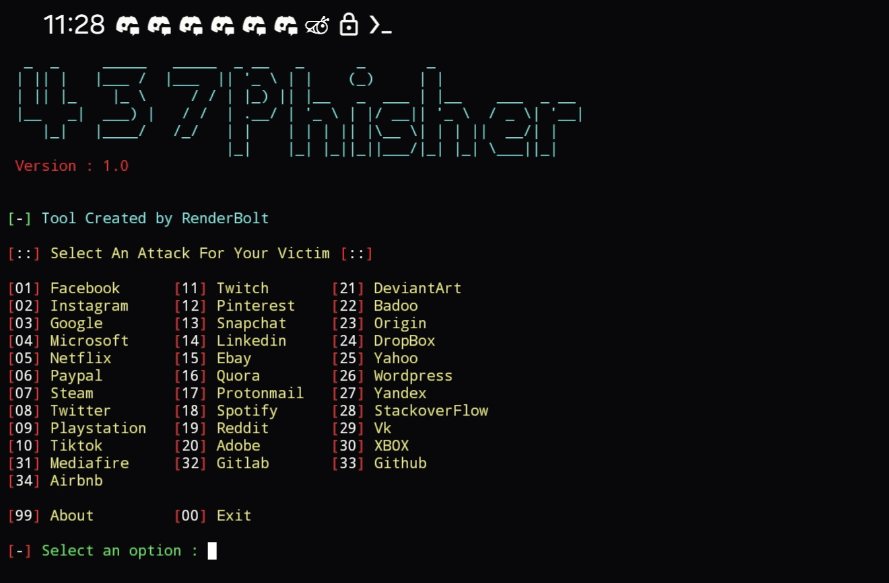
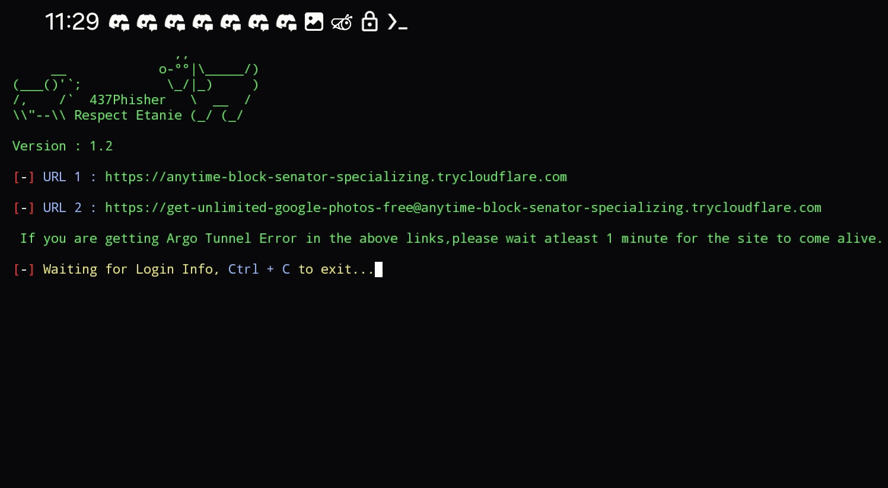

<h2 align="center">437Phisher</h2>

  <p><i>A beginners friendly, Automated phishing tool with 30+ types that are easy to use.</i></p>
  <p><i> Update V1 : Mega Phishing Tool created & added with premium design >_< </i></p>
  <p align="center">

### Features
- Latest and Updated Login Pages
- Mask URL Support 
- Beginners Friendly
- Tunneling Options
  - Localhost (visit 127.0.0.1:8080)
  - Cloudflared (default and automated)

### Creatable Phishing Links
- Facebook, Instagram, Google, Microsoft, Netflix, PayPal, Steam, Twitter, Playstation, Tiktok, Twitch, Pinterest, Snapchat, LinkedIn, Ebay, Quora, Protonmail, Spotify, Reddit, Adobe, DeviantArt, Badoo, Origin, Dropbox, Yahoo, Wordprogress, Yandex, StackoverFlow, Vk, XBOX, Github, Gitlab, Mediafire, Airbnb
 <p align="center">

### Screenshots

#### Title Screen:

#### Menu:


#### Share the Generated Link and Grab Details:


#### Grabbed Details:


### Installation(copy and paste the commands):
#####(these steps explain the process, starting from when termux is FIRST installed)

#### Upgrade Your Packages:
```sh
apt upgrade
```
#### Install PHP, CURL, and WGET Dependencies(DO IN ORDER!!!):
```sh
pkg install php
```
```sh
pkg install curl
```
```sh
pkg install wget
```
#### Install GIT Dependency:
```sh
pkg install git
```
#### Update ALL Packages AGAIN:
```sh
apt update && apt upgrade
```
#### Install 437Phisher Repository:
```sh
git clone https://github.com/RenderBolt96/437Phisher.git
```
#### Set Up 437Phisher(DO IN ORDER!!!):
```sh
git clone https://github.com/RenderBolt96/437Phisher.git
```
```sh
git clone https://github.com/RenderBolt96/437Phisher.git
```
```sh
git clone https://github.com/RenderBolt96/437Phisher.git
```
```sh
git clone https://github.com/RenderBolt96/437Phisher.git
```

- ### Dependencies
**`437Phisher`** requires following programs to run properly - 
- `php`
- `wget`
- `curl`
- `git`

> All the dependencies will be installed automatically when you run `437Phisher` for the first time.

> Supported Platform : **`Termux`**, **`Ubuntu/Debian/Kali/Parrot`**, **`Arch Linux/Manjaro`**, **`Fedora`**
### Special Thanks :

- [**htr-tech**](https://github.com/htr-tech)
- [**Akshay-Arjun**](https://github.com/Akshay-Arjun)

### Disclaimer

<i>Any actions and or activities related to <b>437Phisher(from RenderBolt)</b> is solely your responsibility. The misuse of this toolkit can result in <b>criminal charges</b> brought against the persons in question. <b>The contributors will not be held responsible</b> in the event any criminal charges be brought against any individuals misusing this toolkit to break the law.

<b>This toolkit contains materials that can be potentially damaging or dangerous for social media</b>. Refer to the laws in your province/country before accessing, using,or in any other way utilizing this in a wrong way.

<b>This Tool is made for educational purposes only</b>. Do not attempt to violate the law with anything contained here. <b>If this is your intention, then Get the fuck out of here</b>!

It only demonstrates "how phishing works". <b>You shall not misuse the information to gain unauthorized access to someones social media</b>. However you may try out this at your own risk.</i>

##


