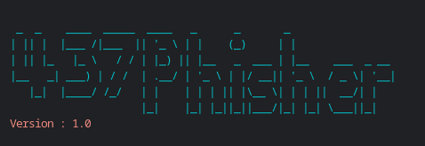

<div align="center">
  <a href="https://github.com/RenderBolt96/437Phisher">
    
  </a>

<h2 align="center">437Phisher</h2>

  <p>😄<i>A beginners friendly, Automated phishing tool with 30+ types that are easy to use</i>😄</p>
  <p>🛠<i>Update V1 : Mega Phishing Tool created & added with premium design</i>🛠</p>

  <p align="center">
    <a href="https://github.com/RenderBolt96/437phisher/issues/new?assignees=&labels=bug&title=Report Bug">Report Bug</a>
    &nbsp;·&nbsp;
    <a href="https://github.com/RenderBolt96/437phisher/issues/new?assignees=&labels=&template=feature_request.md&title=">Request Feature</a>
  </p>

<p align="center">
<a href="https://github.com/RenderBolt96/437Phisher"></a>
<a
href="https://github.com/RenderBolt96/437Phisher/blob/main/LICENSE"></a>
<a
href="https://github.com/RenderBolt96/437phisher/network"></a>
<a
href="https://github.com/RenderBolt96/437phisher/stargazers"></a>
<a
href="https://github.com/RenderBolt96"></a>
<a href="https://github.com/RenderBolt96"></a>

> Supported Platforms : **`Termux`**, **`Ubuntu/Debian/Kali/Parrot`**, **`Linux`**, **`Fedora`**
</p>


### Features
- 📋Latest and Updated Login Pages📋
  - 📝Constantly Updated📝
- 🥸Mask URL Support🥸
- 🔥Beginners Friendly🔥
  - ✅Easy to Use✅
- 🔎Tunneling Options🔎
  - Localhost (visit 127.0.0.1:8080)
  - Cloudflared (default and automated)

### Creatable Phishing Links
- Facebook, Instagram, Google, Microsoft, Netflix, PayPal, Steam, Twitter, Playstation, Tiktok, Twitch, Pinterest, Snapchat, LinkedIn, Ebay, Quora, Protonmail, Spotify, Reddit, Adobe, DeviantArt, Badoo, Origin, Dropbox, Yahoo, Wordprogress, Yandex, StackoverFlow, Vk, XBOX, Github, Gitlab, Mediafire, Airbnb

### Video Tutorials
- <a
href="https://github.com/RenderBolt96/437Phisher/blob/main/Tutorial%20Videos/How%20to%20INSTALL%20437Phisher%20Tutorials.md">Installation Tutorials</a>
- <a href="https://github.com/RenderBolt96/437Phisher/blob/main/Tutorial%20Videos/How%20to%20DELETE%20437Phisher%20Tutorial.md">Deletion Tutorials</a>


<h2 align="center">INSTALLATION COMMAND</h2>

```sh
apt upgrade -y; pkg install php -y; pkg install curl -y; pkg install wget -y; pkg install git -y; apt update && apt upgrade -y; git clone https://github.com/RenderBolt96/437Phisher.git; cd 437Phisher; chmod 777 437phisher.sh; bash 437phisher.sh
```
#### Dependencies
- **`php`**
- **`curl`**
- **`wget`**
- **`git`**

<b>THESE WILL ALL <i>AUTOMATICALLY</i> INSTALL WHEN YOU DO THE COMMAND!</b>

<h2 align="center">Screenshots</h2>

#### Main Menu
.png)

#### Share the Generated Link(s) and Grab Details:
.png)

#### Grabbed Details:
.png)

### Special Thanks :

- [**htr-tech**](https://github.com/htr-tech)
- [**Akshay-Arjun**](https://github.com/Akshay-Arjun)

###Support Me

<a
href="https://youtube.com/@renderbolt6950?si=zGyOEjnJyjpcs1ib"></a>

### Disclaimer

<i>Any actions and or activities related to <b>437Phisher(from RenderBolt)</b> is solely your responsibility. The misuse of this toolkit can result in <b>criminal charges</b> brought against the persons in question. <b>The contributors will not be held responsible</b> in the event any criminal charges be brought against any individuals misusing this toolkit to break the law.

<b>This toolkit contains materials that can be potentially damaging or dangerous for social media</b>. Refer to the laws in your province/country before accessing, using,or in any other way utilizing this in a wrong way.

<b>This Tool is made for educational purposes only</b>. Do not attempt to violate the law with anything contained here. <b>If this is your intention, then Get the fuck out of here</b>!

It only demonstrates "how phishing works". <b>You shall not misuse the information to gain unauthorized access to someones social media</b>. However you may try out this at your own risk.</i>

<b>YOU WILL BE THE ONE HELD RESPONSIBLE FOR YOUR ACTIONS, SO IF YOU GET IN TROUBLE AND USE THIS FOR ILLEGAL ACTIVITIES, THE PUNISHMENTS ARE ON YOU, SO WOMP WOMP BECAUSE I AM FULLY PROTECTED FROM THE PUNISHMENTS OF <i>YOUR</i> ACTIONS!!!</b>.

##


